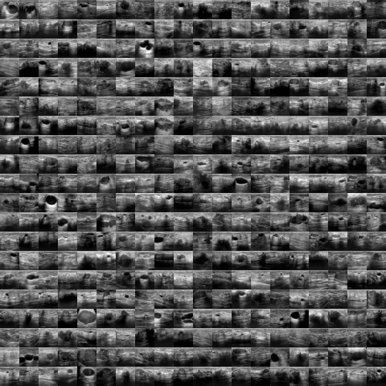

# Automated Classification of Breast Ultrasounds

This repository contains all code and resources from a project that uses machine learning techniques to improve the metrics of the ResNet-18 neural network for breast ultrasound classification. The project's goal was to develop a ResNet-18-based binary image classifier for the BreastMNIST dataset and surpass the baseline metrics of AUC ($\ge0.901$) and ACC ($\ge0.863$).

**Project Title:** Automated Classification of Breast Ultrasounds

    

## **Poster:** [Click me](poster.pdf)

## **Jupyter Notebook:** [Click me](notebook.ipynb)

## Key Findings

The proposed model, a modified ResNet-18, successfully surpassed the MedMNIST-v2's ResNet-18 baseline metrics:

* **AUC:** The proposed model's AUC improved by +0.056 (+6.2%), achieving 0.957 on the test split.
* **ACC:** The proposed model's accuracy improved by +0.06 (+7%), achieving 0.923 on the test split.
* **Overfitting:** The model still seems to be overfitting, which is likely related to the small size of the BreastMNIST dataset.

## Technical Details

The project used a modified ResNet-18 neural network with a random search technique for hyperparameter tuning.

* **Model Modifications:**
    * The first convolutional layer was adjusted to accept single-channel grayscale images instead of the original three-channel RGB images.
    * The padding, kernel size, stride, and bias of the first convolutional layer were set to 1, 3, 1, and True, respectively, to preserve spatial dimensions and enhance feature capture from the small images.
    * The fully connected layer was replaced with a sequential layer containing a dropout layer and a final linear layer. The dropout layer helps prevent overfitting, especially with the small dataset, while the linear layer was modified to output binary classifications.
* **Hyperparameters:**
    * The hyperparameters were selected using a random search technique and are shown in Table 1.
    * **Learning Rate:** 0.001
    * **Mini-batch Size:** 32
    * **Dropout:** 0.8
    * **Momentum:** 0.9
    * **Weight Decay:** 0.0001
    * **Step Size:** 20
    * **Gamma:** 0.7
* **Training & Evaluation:**
    * **Loss Function:** The Cross-Entropy Loss function was used, as it is suitable for binary classification.
    * **Optimiser:** Stochastic Gradient Descent (SGD) was used to minimise the loss function for a maximum of 30 epochs.
    * **Validation:** An early stopping strategy was employed, evaluating on the validation set and monitoring the mean of AUC and ACC to help prevent overfitting.
    * **Hardware:** All training, validations, and tuning were conducted using a Google T4 GPU and the PyTorch framework.

## Methodology & Key Takeaways

The project's methodology included modifying a pre-trained ResNet-18 model, tuning its hyperparameters, and evaluating its performance against established baselines using various metrics and a 5-fold cross-validation experiment.

* **Comparison of Metrics:**
    * **AUC vs. Accuracy:** AUC (Area Under the Curve) is computed by the summation of all accuracies across all possible threshold values, whereas accuracy is computed at a threshold of 0.5. The model's accuracy at the 0.5 threshold was lower than the AUC, suggesting it might perform better at a different threshold.
    * **AUPR vs. F1 Score:** Similarly, AUPR considers metrics for different thresholds, while the F1 score is a harmonic mean of precision and recall at a specific threshold. The F1 score was found to be lower than the AUPR metric.
* **5-Fold Cross-Validation:** The 5-fold cross-validation metrics were found to provide a more accurate representation of the model's performance, as the model is trained and tested on different subsets of the merged dataset. The 5-fold validation results were lower than the original test results, indicating the model's performance may be comparable to or even worse than the baseline.

This project highlights the importance of thorough evaluation techniques, such as cross-validation, and the use of multiple metrics to get a complete picture of a model's performance.